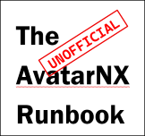

[The Unofficial AvatarNX Runbook](../README.md) ❬ AvatarNX ❬ **Setting up an InterSystems IRIS ODBC connection**

  <picture>
    <source media="(prefers-color-scheme: dark)" srcset="../.github/repository/logo/TheUnofficialAvatarNxRunbook-Logo-162x152.png">
    <source media="(prefers-color-scheme: light)" srcset="../.github/repository/logo/TheUnofficialAvatarNxRunbook-Logo-162x152.png">
    
  </picture>

   

  <h1>Setting up an InterSystems IRIS ODBC connection</h1>

## Differences between InterSystems CACHE and InterSystems IRIS

There are a few differences when installing and configuring an ODBC connection to an ***InterSystems IRIS***, compared to an ***InterSystems CACHE*** database:

* Since InterSystems IRIS databases are hosted on Amazon Web Services (AWS), connectivity requires an additional level of security in the form of encryption via the `SSLDefs.ini` file

* Use of the InterSystems IRIS driver instead of the InterSystems CACHE driver

* The connection string has changed from `organization.ecp.netsmartcloud.com` to `sorganization.rpt.netsmartcloud.com`

* Where InterSystems CACHE used a *single port for all Avatar Systems*, InterSystems IRIS uses a *different port for each Avatar System*:

| Avatar | Port |
| ------:| :--- |
|   LIVE | 1972 |
|    UAT | 1974 |
|   SBOX | 1976 |
|    BLD | 1973 |

## Requirements

ODBC connections to an InterSystems IRIS requires:

* A private connection to AvatarNX database (VPN or MPLS)

* Client specific ODBC Connection address (e.g., `organization.rpt.netsmartcloud.com`)

* An Avatar user that ***is not NIAM enabled*** and has access to tables in targeted namespace(s)

* The **64-bit** InterSystems IRIS ODBC driver (e.g. `ODBC-2024.3.0.217.0-win_x64.exe`)

* Permissions to be able to install the updated driver, create folders and write files to folders.

* The `SSLDefs.ini` encryption file

## Setting up the InterSystems IRIS ODBC Connection

### Installing the driver

1. Install the 64-bit version of the InterSystems IRIS ODBC driver

2. If the `C:\Program Files (x86)\Common Files\Intersystems\IRIS` folder does not exist on the local machine, create it.

3. Copy `SSLDefs.ini` to `C:\Program Files (x86)\Common Files\Intersystems\IRIS`

### Creating the ODBC connection

Using the **ODBC Data Source Adminitrator (64-bit)** application:

1. Under the **User DSN tab**, click the **Add** button

2. In the **Create New Data Source** window, choose **InterSystems IRIS ODBC35 driver**, then click **Finish**

3. Host (IP Address): `organization.rpt.netsmartcloud.com`

4. Port: *See table above*

5. Namespace: `AVPM`

6. Authentication Method: `Password with SSL/TLS`

7. SSL/TLS Server Name: `organization.rpt.netsmartcloud.com`

8. User Name: `%AvatarSystem%:%AvatarUserName%`

9. Password: `%AvatarUserPassword%`

10. Click **Test Connection**

If the connection test was successful, click **OK**

> Last updated: April29, 2026

[The Unofficial AvatarNX Runbook](../README.md) ❬ AvatarNX ❬ **Setting up an InterSystems IRIS ODBC connection**