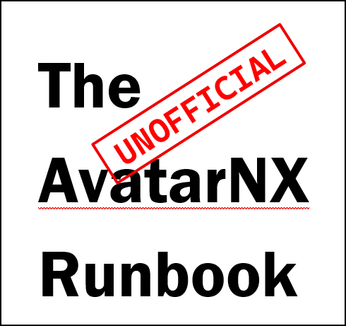

<!--
  260422_code
  260422_documentation
-->

<!-- [PROJECT INTRO] ===========================================================
* Project logo
  There are references for both a "light" and "dark" images. The dark image
  should have a background of HEX #0d1117, to match the dark mode of GitHub.
  The light image is the fallback.
* Project title
* Project catchphrase!
* Project badges
---------------------------------------------------------------------------- -->

  <picture>
    <source media="(prefers-color-scheme: dark)" srcset=".github/repository/logo/TheUnofficialAvatarNxRunbook-Logo-490x461.png">
    <source media="(prefers-color-scheme: light)" srcset=".github/repository/logo/TheUnofficialAvatarNxRunbook-Logo-490x461.png">
    
  </picture>

  &nbsp;&nbsp;

---

<!-- ======================================================= [PROJECT INTRO] -->

<!-- [TABLE OF CONTENTS] =======================================================
* The Table of Contents
  The Table of Contents contains components that aren't in/don't belong in the
  horizontal menu.
---------------------------------------------------------------------------- -->

### CONTENTS

  [AvatarNX](/Runbook/AvatarNX/) 
  [OrderConnect](/Runbook/OrderConnect/) 
